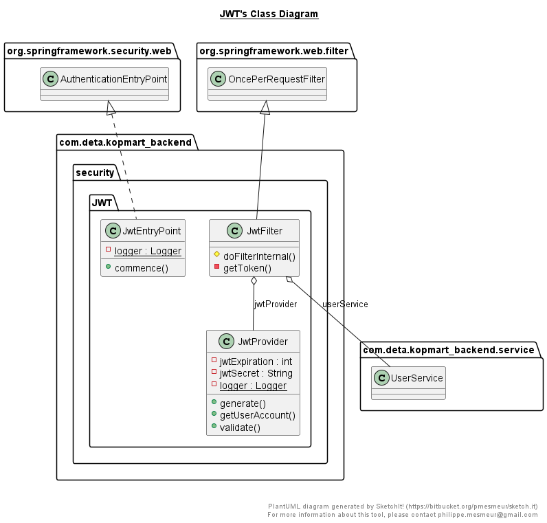

import Bleed from 'nextra-theme-docs/bleed'

# Class Diagram

Class diagram atau diagram kelas adalah salah satu jenis diagram struktur pada UML yang menggambarkan dengan jelas struktur serta deskripsi class, atribut, metode, dan hubungan dari setiap objek. Ia bersifat statis, dalam artian diagram kelas bukan menjelaskan apa yang terjadi jika kelas-kelasnya berhubungan, melainkan menjelaskan hubungan apa yang terjadi.

Berikut adalah diagram kelas dari web application kopmart :

1. Controller Class
   <Bleed></Bleed>
2. Entity Class
   <Bleed></Bleed>
3. Enum

<Bleed></Bleed>

4. Exception Class

<Bleed></Bleed>

5. Form Class

<Bleed></Bleed>

6. Repository Class

<Bleed></Bleed>

7. Security Class
   - JWT Class

<Bleed></Bleed>

   - Security Config

<Bleed></Bleed>

8. Service Class
- Service Interface

<Bleed></Bleed>

- Service Implementation

<Bleed></Bleed>

9. Value Object
- Request Object

<Bleed></Bleed>

- Response Object

  
<Bleed></Bleed>

