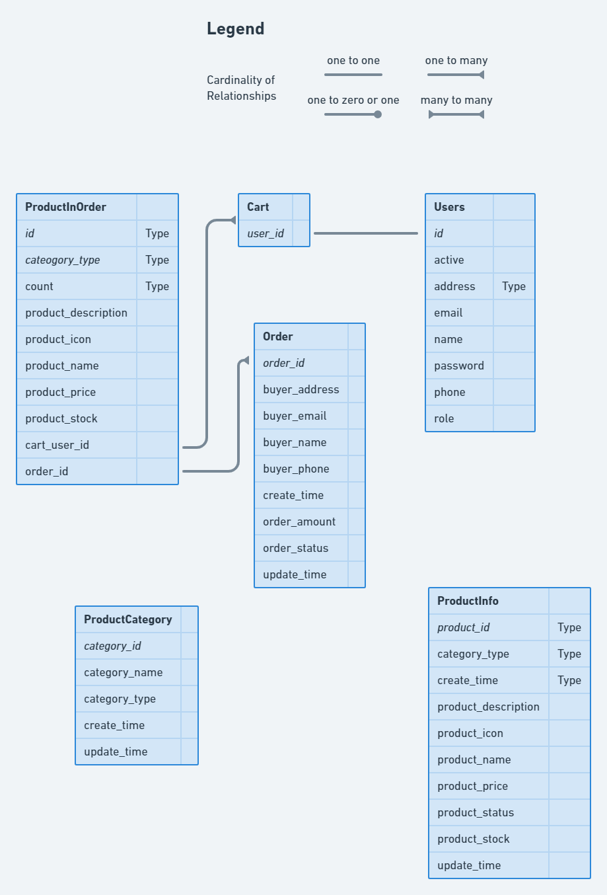

import Bleed from 'nextra-theme-docs/bleed'

# ERD

ERD (Entity Relationship Diagram) atau diagram hubungan entitas adalah sebuah diagram yang digunakan untuk perancangan suatu database dan menunjukan relasi atau hubungan antar objek atau entitas beserta atribut-atributnya secara detail. Dengan menggunakan ERD, sistem database yang sedang dibentuk dapat digambarkan dengan lebih terstruktur dan terlihat rapi.

<Bleed></Bleed>
