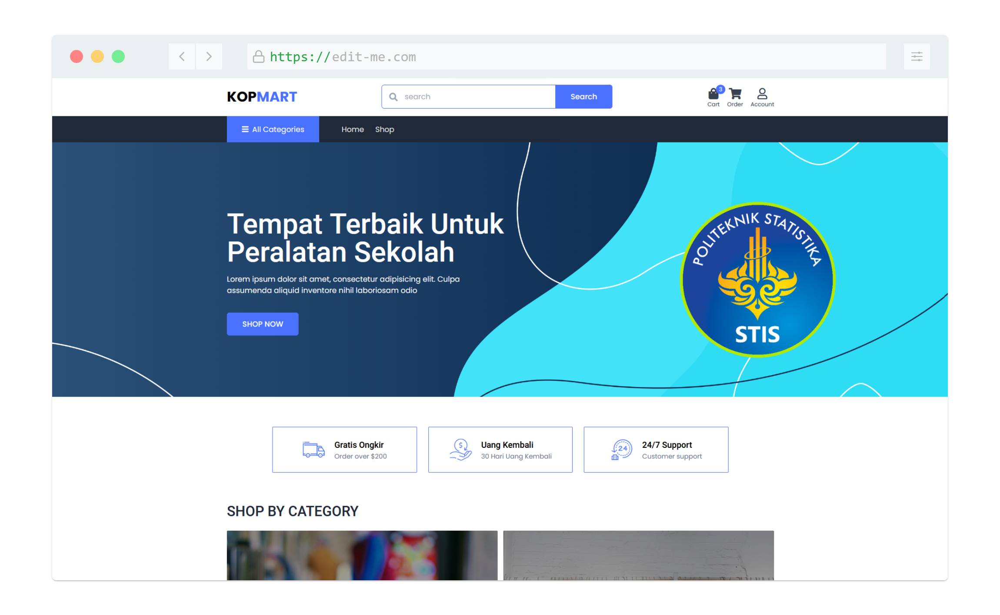

import Bleed from 'nextra-theme-docs/bleed'

# Kopmart

[**Kopmart**](https://kopmart-frontend.vercel.app/) ada sebuah marketplace untuk membeli dan menjual alat-alat keperluan kuliah mahasiswa di Polstat STIS

Marketplace atau toko online merupakan salah satu konsep yang cukup
berkembang dalam dunia internet. Penggunaan sistem ini dapat
menguntungkan banyak pihak, baik pihak konsumen, produsen maupun
penjual. Konsep online shopping menyediakan banyak kemudahan dan
kelebihan jika dibandingkan dengan konsep belanja yang konvensional.
Selain proses transaksi bisa menjadi lebih cepat, konsep toko online atau e- commerce dapat memangkas banyak biaya operasional karena penjual tidak
diharuskan punya toko fisik.

Terutama pada pandemi COVID-19, marketplace ini sudah menjadi salah satu bagian kebutuhan masyarakat yang harus menjaga jarak dan tidak berkerumum.
Maka dari itulah dikembangkan sebuah website toko online untuk membantu mahasiswa Polstat STIS dalam memenuhi kebutuhan mereka tanpa harus berkerumum.

<Bleed></Bleed>
