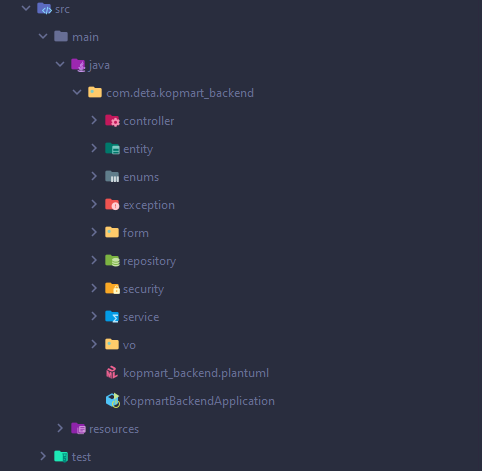
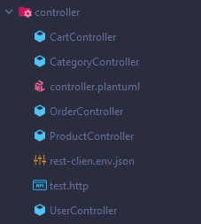
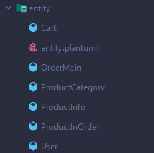
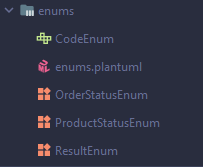
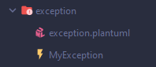
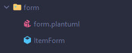
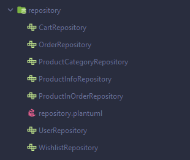
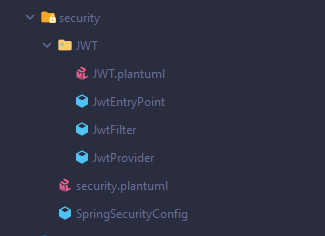
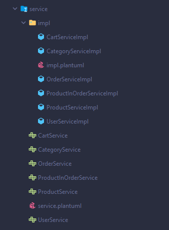
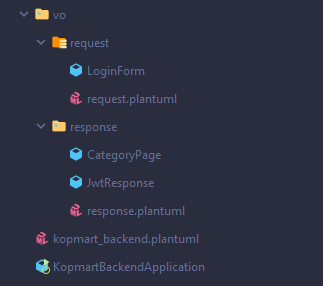

import Bleed from 'nextra-theme-docs/bleed'

# Struktur Folder

Spring Boot adalah framework independen yang membuat hidup kita sangat mudah karena kita tidak harus memilih versi dependensi yang berbeda berdasarkan versi framework Spring, semuanya diurus oleh Spring Boot.

Pada project kopmart ini, developer mengikuti struktur folder berdasarkan layer yang ada di dalam framework. Berikut struktur folder yang ada di dalam projek ini:

<Bleed></Bleed>

## Controller

<Bleed></Bleed>

Bagian controller berfungsi untuk menggabunggkan semuanya bersama-sama sejak request diterima hingga respons disiapkan dan dikirim kembali. Controller layer hadir dalam package controller.

## Entity

<Bleed></Bleed>

Bagian entity berfungsi untuk menyimpan data yang akan dikirimkan ke dalam database. Entity layer hadir dalam package entity.

## Enums

<Bleed></Bleed>

Bagian enums merupakan sebuah utility class yang berfungsi untuk membuat enum, bagian ini berfungsi untuk memberikan efisiensi dan fleksibilitas dalam penggunaan memori. Veriabel enum hanya akan mengambil satu nilai dari konstanta yang ada.

## Exception

<Bleed></Bleed>

Bagian exceptions berfungsi untuk menangani exception yang terjadi pada saat proses pemrosesan. Exception layer hadir dalam package exception.

## Form

<Bleed></Bleed>

Bagian ini terdapat sebuah kelas form untuk menangani login form yang akan dikirimkan ke dalam database. Form layer hadir dalam package form.

## Repository

<Bleed></Bleed>

Repositori berisi mekanisme untuk mengenkapsulasi penyimpanan, pengambilan, dan perilaku pencarian yang mengemulasi kumpulan objek. Ini adalah spesialisasi dari anotasi @Component yang memungkinkan kelas implementasi dideteksi secara otomatis melalui pemindaian classpath.

## Security

<Bleed></Bleed>

Security setting ada di bawah paket configuration dan configuration sebenarnya dilakukan di bawah kelas yang ada dalam package security. Aplikasi memiliki konsep keamanan yang berbeda untuk portal admin dan REST API, untuk portal kopmart telah menerapkan mekanisme spring session default yang didasarkan pada konsep sessionID dan cookie. Untuk REST API kopmart telah menggunakan mekanisme otentikasi berbasis token JWT.

## Service

<Bleed></Bleed>

Service layer berfungsi untuk menangani proses yang berhubungan dengan database. Dengan menggunakan repository, service dapat dengan efektif menambahkan, mengubah, dan menghapus data.

## Value Object

<Bleed></Bleed>

Value Object menyimpan data yang akan dikirimkan ke dalam database. Value Object layer hadir dalam package valueobject.
