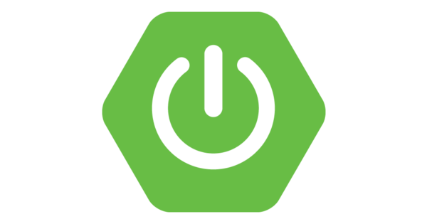

import Bleed from 'nextra-theme-docs/bleed'

# Teknologi Yang Digunakan

Pada pengembangan web application kopmart ini, digunakan beberapa teknologi yang sesuai ketentuan dari project akhir mata kuliah Pemrograman Berorientasi Objek.

**1. Backend**

Pada bagian backend digunakan framework Java, yaitu Spring Boot.

<Bleed></Bleed>

Adapun dependency yang digunakan adalah:

- Spring web
- Spring Security
- Spring Data JPA
- PostgreSQL Driver
- Hibernate Validator
- JUnit
- Mockito
- Lombok
- Swagger
- JWT (Json Web Token)

**2. Frontend**

Pada bagian frontend digunakan framework Javascript, yaitu Angular 13

<Bleed></Bleed>

**3. Database**

Pada bagian database digunakan Database Management System, yaitu PostgreSQL.

<Bleed></Bleed>

**4. Deployment**

Pada bagian deployment digunakan platform cloud hosting yaitu [Heroku](https://www.heroku.com) untuk bagian backend dan [Vercel](https://vercel.com/) untuk bagian frontend.
